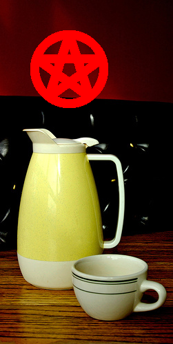
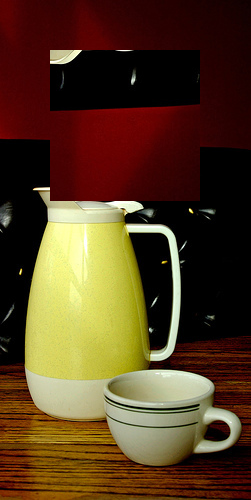
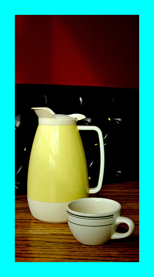

# PNG Graphic Editor

A powerful command-line tool for processing PNG images with various geometric operations and effects.

## ✨ Features

### Drawing Operations
- **Rectangle** - with customizable border thickness, colors, and fill
- **Hexagon** - regular hexagon drawing with optional fill
- **Pentagram** - inscribed in a circle with configurable parameters
- **Circle** - with precise thickness control

### Image Transformations
- **Mirror** - reflect rectangular regions horizontally or vertically
- **Outside Ornament** - add decorative borders/frames around images
- **Image Info** - display detailed PNG metadata

## 🚀 Installation

### Prerequisites
#### Linux (Ubuntu/Debian)
```
sudo apt-get update
sudo apt-get install libpng-dev build-essential
```
#### macOS (using Homebrew)
```
brew update
brew install libpng pkg-config
```
#### Windows
1) Download libpng from libpng.org
2) Download zlib from zlib.net
3) Follow build instructions in libpng documentation

### 🔧 Build
```
# clone the repository
git clone https://github.com/Danila1354/PNG-Graphic-Editor.git
cd PNG-Graphic-Editor/

# Build the project
make
```

### 📖 Usage
#### Basic Syntax
```
./cw --input input.png --output output.png [options]
```
#### Examples
Draw a red pentagram:
```
./cw --input ./img.png --output ./output_pent.png --pentagram --center 100.100 --radius 50 --thickness 12 --color 255.0.0
```
| Input | Output |
|------|--------|
|  |  |

Mirror a region:
```
./cw --input ./img.png --output ./output_mirror.png --mirror --axis y --left_up 50.50 --right_down 200.200
```
| Input | Output |
|------|--------|
|  |  |

Add a decorative border:
```
./cw --input ./img.png --output ./output_ornament.png --outside_ornament --thickness 30 --color 0.255.255
```
| Input | Output |
|------|--------|
|  |  |

### 🛠️ Command Reference

| Flag | Description | Required With |
|------|-------------|---------------|
| `--input`, `-i` | Input PNG file | Always |
| `--output`, `-o` | Output PNG file | Most operations |
| `--help`, `-h` | Show help message | - |
| `--info` | Display image metadata | `--input` |
| `--mirror` | Mirror image region | `--axis`, `--left_up`, `--right_down` |
| `--rect` | Draw rectangle | `--left_up`, `--right_down`, `--thickness`, `--color` |
| `--hexagon` | Draw hexagon | `--center`, `--radius`, `--thickness`, `--color` |
| `--pentagram` | Draw pentagram | `--center`, `--radius`, `--thickness`, `--color` |
| `--outside_ornament` | Add border | `--thickness`, `--color` |
| `--fill` | Fill shapes | Optional with `--rect`/`--hexagon` |
| `--fill_color` | Fill color | With `--fill` |

#### Coordinate Format

Points: X.Y (e.g., 100.150)  
Colors: R.G.B (0-255, e.g., 255.0.128)
